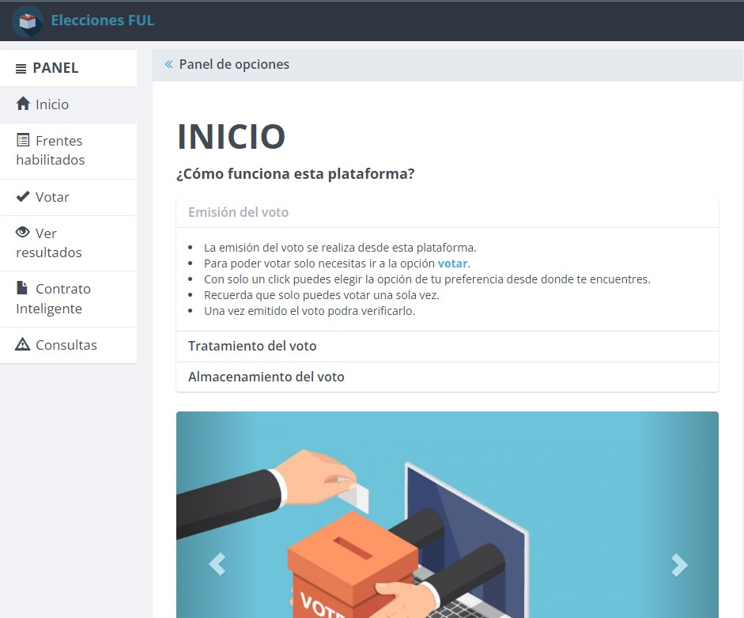
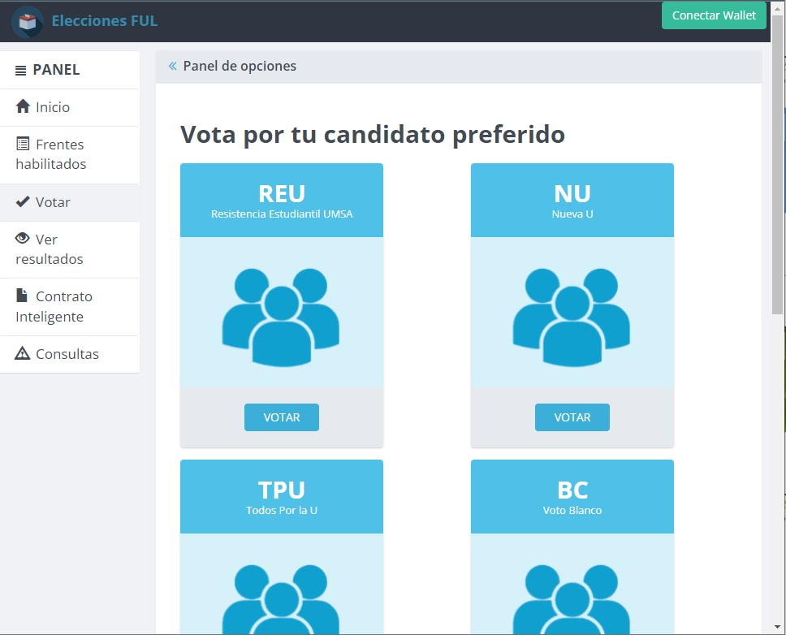

# PROTOTIPO DE UNA APLICACIÓN DESCENTRALIZADA DE VOTACIÓN
## Características de la aplicación
* Una aplicación desarrollada con contratos inteligentes en el lenguaje Solidity perteneciente a Ethereum.
* Contratos desplegado localmente con Ganache
* Contratos bajo estandar de Tokens ERC20 - 721
* Módulos de votación y conteo

### Pantalla de inicio

  

### Pantalla módulo de votación

## Recreación del prototipo
* Requerimientos
  1. Se necesita la aplicación Ganache  
  2. Se necesita NODEJS
  3. Metamask (Conectado con Ganache)
* Manera de replicar
  1. Clonar el repositorio  https://github.com/coderoycc/DappVotacion.git en una carpeta
  2. Desde la carpeta donde se clonó el repositorio ejecutar: `npm install`
  3. Ejecute Ganache en el puerto **7545**, si quiere cambiar el puerto solo modifique el archivo truffle.js la parte de **'port: 7545'**
  4. Para desplegar los contratos inteligentes localmente, ejecutar los sisguienes comandos en la consola (debe estar en la carpeta del proyecto). 
      * `truffle compile`
      * `truffle migrate --reset`
  5. Finalmente ejecutar `npm run dev`
* El servidor local se estará ejecutando en el puerto 7545 o en el que definió en el archivo **truffle.js**
* Basta con ingresar al navegador con la direccion local y el puerto.

